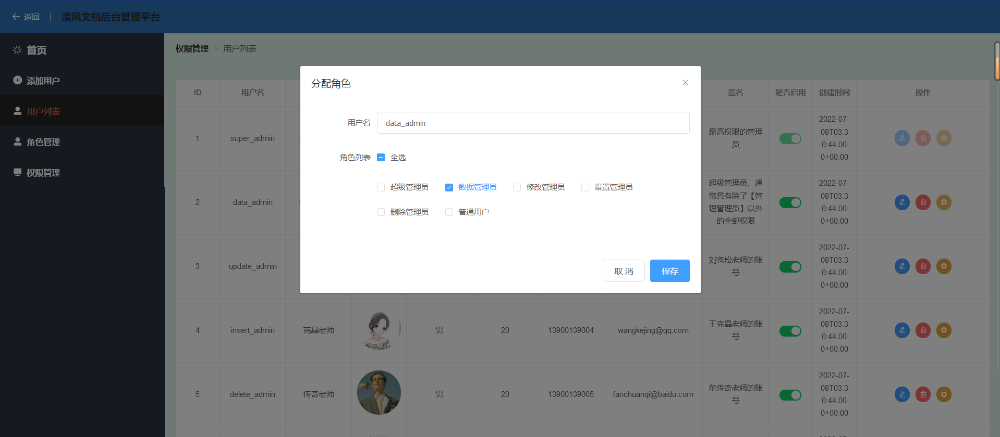
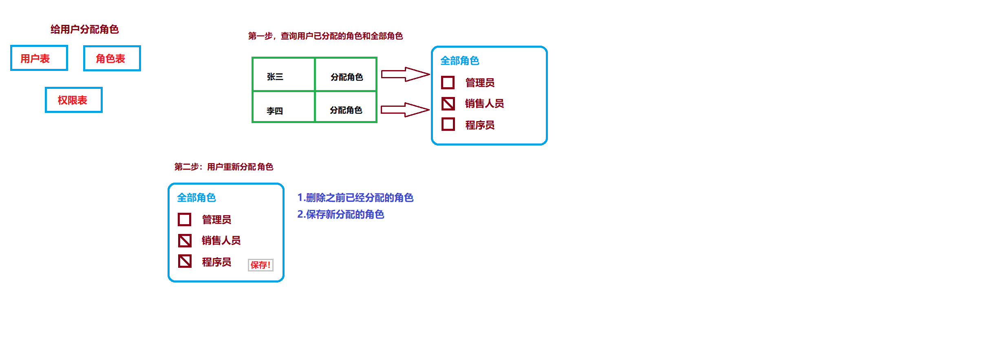

# 分配角色的痛点：

对于权限分配需要考虑的问题：角色分配

要求：

需要将开发粒度放缩到按钮级别！

一个用户可以对应多个角色数据！

#### 1.准备角色数据

设置按钮，以弹窗的形式为用户呈现可选角色数据：



##### 实现思路：

在点击控件弹框后发送请求获取后台所有角色数据以及勾选当前用户的角色并记录到`oldRoleIds`属性中；

绑定勾选事件，将选择的角色信息存到`checkedRoles`属性中；

**点击保存该次为用户勾选的角色信息，向后端发送请求！**

后端需要接收`oldRoleIds`（原本角色）信息和`checkedRoles`（现在角色）并对用户角色关联表执行**批量删除原来的角色**和**批量添加更新的角色数据**。

1. 从`Element-UI`中引入控件：

   ```css
   <el-form-item label="角色列表" :label-width="formLabelWidth">
     <template>
       <el-checkbox :indeterminate="isIndeterminate" v-model="checkAll" @change="handleCheckAllChange">全选
       </el-checkbox>
       <div style="margin: 15px 0;"></div>
       <!--label标签对应选择的多选框Id-->
       <el-checkbox-group v-model="checkedRoles" @change="handleCheckedCitiesChange">
         <el-checkbox v-for="role in roles" :label="role.id">{{ role.name }}</el-checkbox>
       </el-checkbox-group>
     </template>
   </el-form-item>
   ```

2. `javascript`的实现源码：

   ```javascript
   export default {
     data() {
       return {
         ruleForm: {
           username: '',
           role: ''
         },
         roleIds:[], // 传递选中的角色id
         oldRoleIds:[],// 修改前的角色id
         checkAll: false,
         checkedRoles: [], // 勾选过的角色
         roles: [],// 显示全部角色
         isIndeterminate: true
       }
     },
     methods: {
       // 保存
       submitEdit() {
         // 将选择的角色传递给后端插入到用户角色关联表中
         let object = {username:this.ruleForm.username,roleIds:this.checkedRoles,oldRoleIds:this.oldRoleIds};
         console.log("角色："+this.checkedRoles)
         let url = this.GLOBAL.systemUrl + "userRoles/assignToRole";
         let formString = this.qs.stringify(object);
         this.axios
             .create({
               'headers': {
                 'Authorization': localStorage.getItem('jwt')
               }
             }).post(url,formString).then((response)=>{
           let responseBody = response.data;
           if (responseBody.state == 20000){
             this.$message.success("分配成功！")
             this.oldRoleIds = [];
             this.dialogFormVisible = false;
           }else {
             this.$message.error(responseBody.message);
           }
         })
       },
       // 点击弹框
       setPassport(admin) {
         this.dialogFormVisible = true;
         this.ruleForm.username = admin.username;
         // 查询所有角色，赋值给cities
         let url = this.GLOBAL.systemUrl + "roles" // 请求路径
         console.log('url=' + url);
         this.axios
             .create({
               'headers': {
                 'Authorization': localStorage.getItem('jwt')
               }
             })
             .get(url).then((response) => {// 发送异步请求
           let responseBody = response.data;
           if (responseBody.state == 20000) {
             this.roles = responseBody.data;//将获取响应的数据中的data数据赋值给tableData
           } else {
             this.$message.error(responseBody.message);
           }
         })
         // 查询当前角色id
         let url1 = this.GLOBAL.systemUrl + 'roles/' + admin.id + '/selectToUserId';
         this.axios
             .create({
               'headers': {
                 'Authorization': localStorage.getItem('jwt')
               }
             })
             .post(url1).then((response) => {// 发送异步请求
           let responseBody = response.data;
           if (responseBody.state == 20000) {
             this.checkedRoles = responseBody.data;//将获取响应的数据中的data数据赋值给tableData
             this.oldRoleIds = responseBody.data; //记录原来分配的角色
             console.log("原来："+this.oldRoleIds)
           } else {
             this.$message.error(responseBody.message);
           }
         })
       },
       // 全选的事件
       handleCheckAllChange(val) {
         console.log("点击全选")
         this.checkedRoles = val ? this.roles : [];
         this.isIndeterminate = false;
         let url = this.GLOBAL.systemUrl + "roles/selectRoleIds";
         this.axios
             .create({
               'headers': {
                 'Authorization': localStorage.getItem('jwt')
               }
             }).get(url).then((response)=>{
           let responseBody = response.data;
           if (responseBody.state == 20000){
             this.checkedRoles = responseBody.data;
           }
         })
       },
       // 勾选的事件
       handleCheckedCitiesChange(value) {
         console.log("点击勾选")
         console.log(value)
         let checkedCount = value.length;
         this.checkAll = checkedCount === this.roles.length;
         this.isIndeterminate = checkedCount > 0 && checkedCount < this.roles.length;
       },
     },
   }
   </script>
   ```

##### 业务逻辑图：

